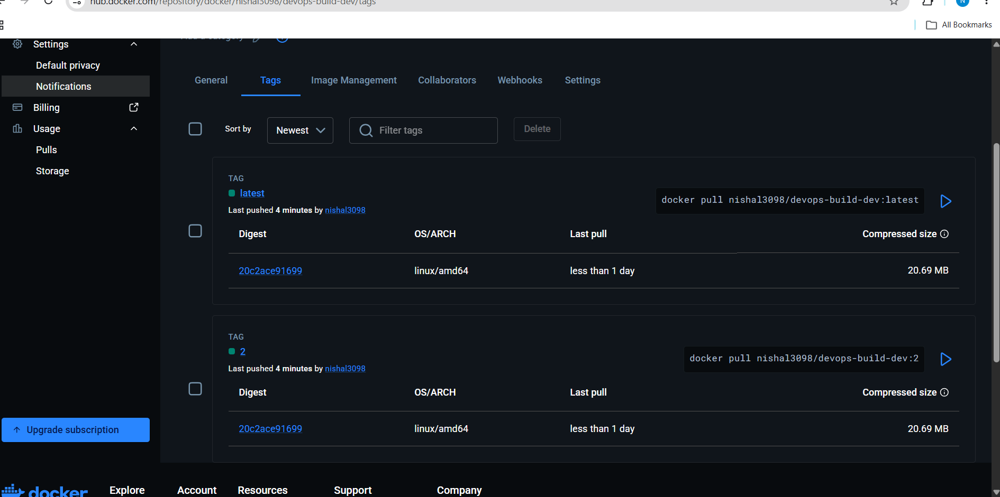
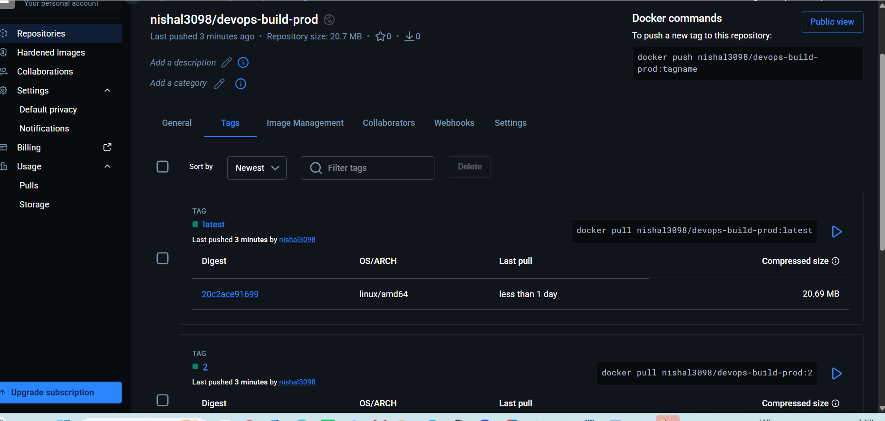
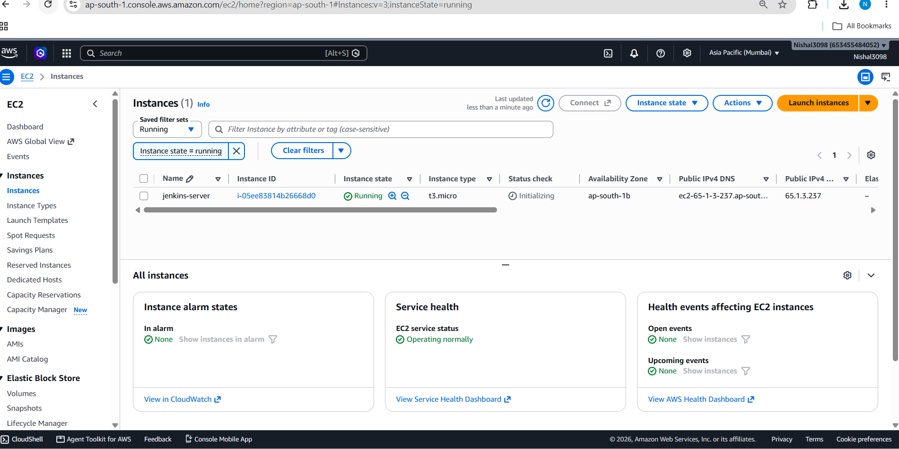
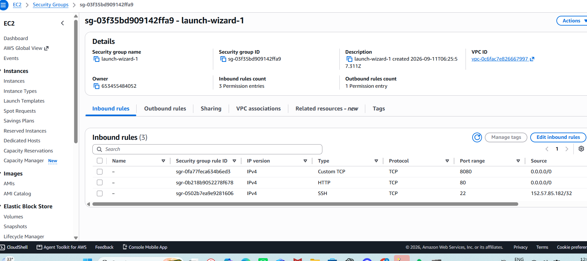
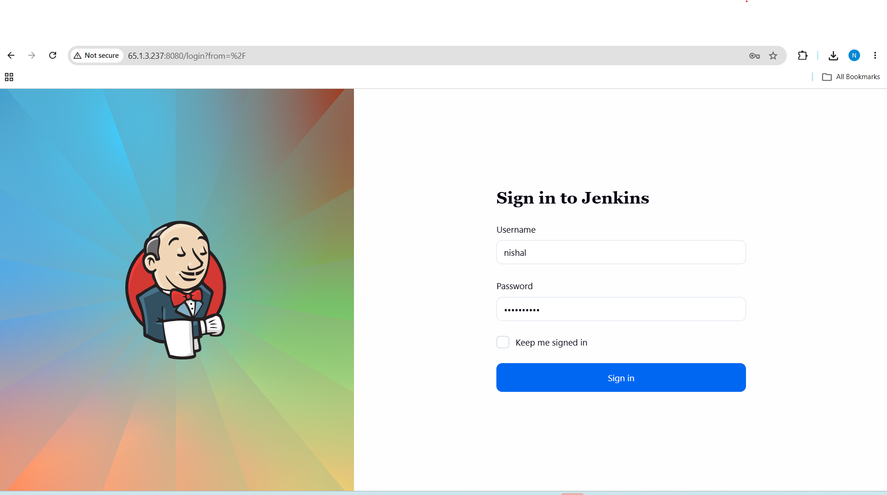
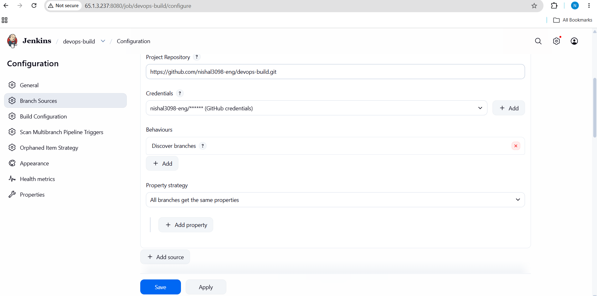
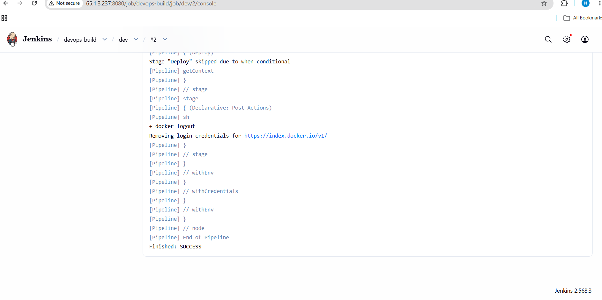
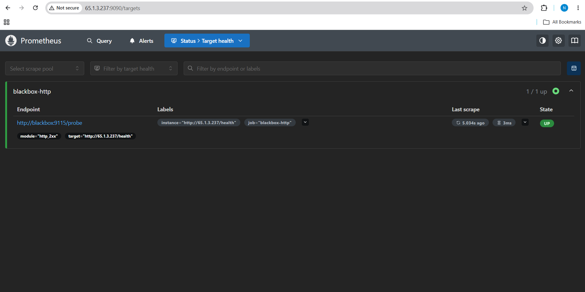
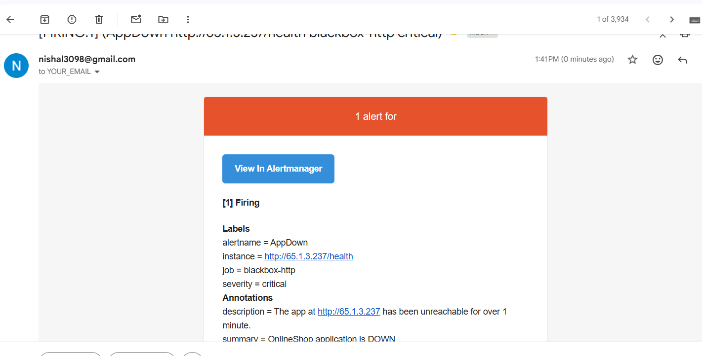
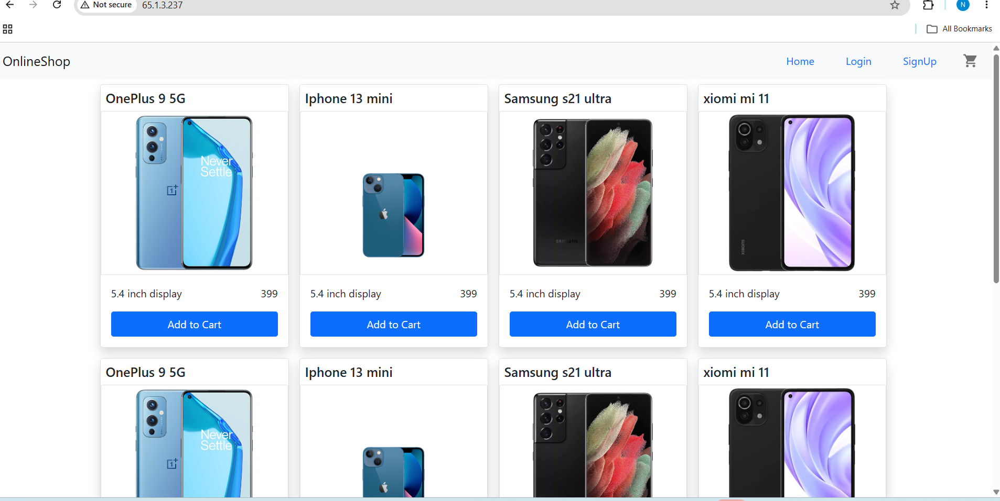

# DevOps Build — Deployment Project

This repository takes a pre-built React application and deploys it all the way to a live, production-style setup on AWS. The whole thing is automated: I push code to GitHub, and a Jenkins pipeline picks it up, builds a Docker image, pushes it to Docker Hub, and rolls it out onto an EC2 server as a running container. The app is served to the internet on port 80, and its health is monitored with Prometheus and Alertmanager, which emails me if the app ever goes down.

## What's in this repo

The application itself is just the finished `build/` folder — the compiled HTML, CSS, JavaScript and image assets of the OnlineShop store. There's no source code or `package.json`, and that's intentional: this is the production build output, so there's nothing to compile. My job was to package and deploy it, not build the React app from scratch. Because of that, the Docker image simply serves the static files with nginx on port 80.

Alongside the app, the repo contains everything needed to deploy it:

- **`Dockerfile`** — packages the app into an nginx container listening on port 80
- **`nginx.conf`** — the nginx config (serves the build, with a `/health` endpoint used by the monitoring checks)
- **`docker-compose.yml`** — runs the image as a container mapping port 80
- **`build.sh`** — a bash script that builds the Docker image
- **`deploy.sh`** — a bash script that pulls the image and runs it on the server
- **`.gitignore` / `.dockerignore`** — keep unrelated files and build artifacts out of Git and the image
- **`Jenkinsfile`** — the CI/CD pipeline (checkout → login → build → push → deploy) with branch-based logic

## How it fits together

In one line: **push to GitHub → Jenkins builds the image and pushes it to Docker Hub → Jenkins deploys it to the EC2 server as a container → the app is served on port 80.** The dev and master branches behave differently, and Prometheus/Alertmanager keep an eye on the running app.

## Submission details

- **GitHub repo:** https://github.com/nishal3098-eng/devops-build
- **Deployed site URL:** http://65.1.3.237
- **Docker images:**
  - `nishal3098/devops-build-dev` (public — receives dev-branch builds)
  - `nishal3098/devops-build-prod` (private — receives master-branch builds)

## Setup — how I built it

### 1. Docker & the application

I wrote a `Dockerfile` that serves the `build/` folder with nginx on port 80, plus a `nginx.conf` that adds a `/health` endpoint for the monitoring checks, and a `docker-compose.yml` to run the image. Two bash scripts wrap the workflow: `build.sh` builds the image and `deploy.sh` pulls and runs it on the server.

### 2. Version control with dev and master

I pushed the codebase to GitHub using the CLI, with a `dev` branch and a `master` branch, and `.gitignore` / `.dockerignore` files to keep the repo and image clean. Development happens on `dev`; releases are merged into `master`.

### 3. Docker Hub repositories

I created two Docker Hub repositories: `devops-build-dev` (public) for development images and `devops-build-prod` (private) for production images. The pipeline pushes to whichever one matches the branch that was built.

### 4. AWS EC2 server

I launched a t3.micro EC2 instance (Ubuntu) to host Jenkins and run the application. The security group is configured so that the application on port 80 is reachable by anyone, while SSH on port 22 is locked to my own IP address — exactly as the brief required. I also added swap space so the small instance handles Jenkins and Docker comfortably.

### 5. Jenkins

Jenkins runs on the EC2 server and drives the whole pipeline. I unlocked it, created an admin user, installed the Docker Pipeline plugin, and added two sets of credentials — my Docker Hub login (stored under the ID `dockerhub`, which the pipeline references) and my GitHub credentials. Then I created a Multibranch Pipeline job pointing at this repo, so Jenkins automatically discovers the `dev` and `master` branches and runs the `Jenkinsfile` on each.

### 6. Monitoring

I set up Prometheus, Alertmanager and the Blackbox exporter (all open-source, running as containers) to watch the application. Blackbox continuously probes the app's `/health` endpoint, Prometheus scrapes that result, and an alert rule fires if the app is unreachable for more than a minute. When it fires, Alertmanager sends an email through Gmail — so I get notified the moment the app goes down.

## The CI/CD pipeline explained

The `Jenkinsfile` is a declarative pipeline with branch-aware stages:

- **Checkout** — pulls the latest code from GitHub.
- **Login to Docker Hub** — authenticates using the stored `dockerhub` credential.
- **Build & Push (dev)** — runs only on the `dev` branch: builds the image and pushes it to the `devops-build-dev` repository, tagged with the build number and `latest`.
- **Build & Push (prod)** — runs only on the `master` branch: builds the image and pushes it to the `devops-build-prod` repository.
- **Deploy** — runs on `master`: pulls the production image and runs it as a container on port 80, replacing the old one.

Because the Jenkins job is a Multibranch Pipeline connected to the GitHub repo, a push to `dev` automatically builds and pushes a dev image, and a merge into `master` builds the production image and redeploys the app. That branch-based automation is what makes it continuous deployment rather than a manual process.

## Result

The application is deployed on the EC2 server and served publicly on port 80.

- **Live app URL:** http://65.1.3.237

